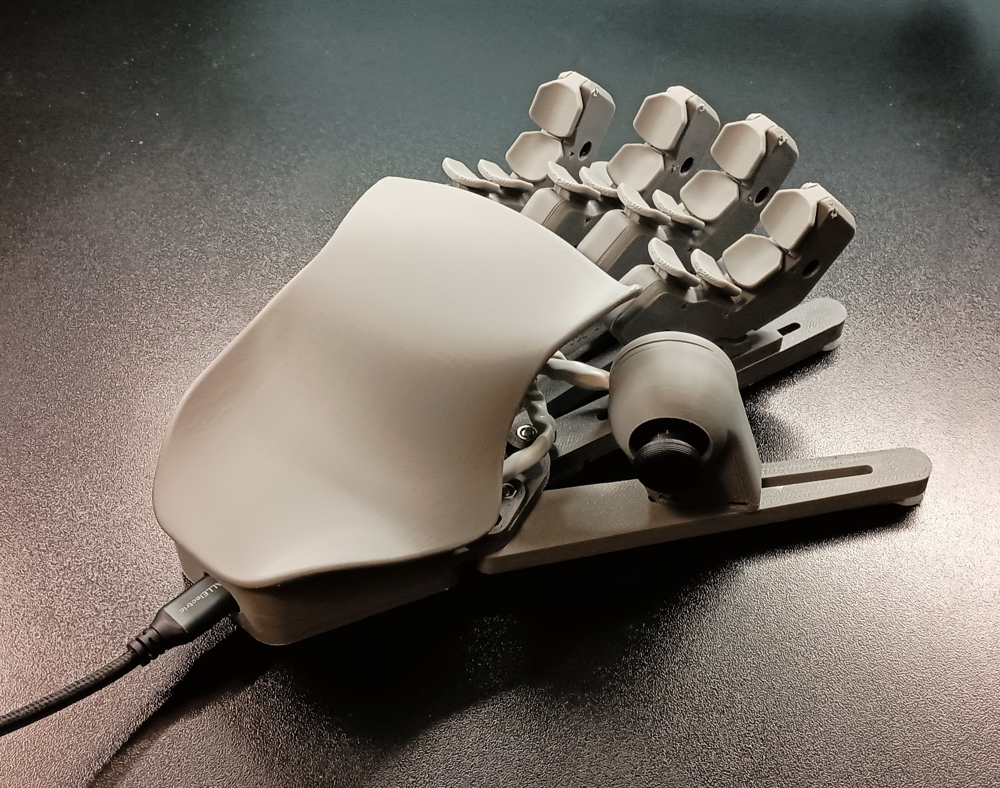

# STM32 HID Device
### The "Cybarrghh" is a custom ergonomic STM32 USB HID controller with configurable firmware and desktop configuration software.

   

## Features:
- Custom STM32 firmware
- Desktop configuration app
- USB HID keyboard/mouse/gamepad implementation
- High polling rate (500hz+)
- NKRO keyboard implementation (allows all keys to be pressed simultaneously)
- Ergonomic design
- Short throw switches
- Complete adjustability
- Input remapping, supporting Keyboard, Mouse, and Gamepad input types

## Hardware

#### Materials/supplies used:
- STM32F411CEU6
- Thumbstick module
- PLA filament
- TPU filament
- CYT1073 microswitches
- CAT5E cable
- Hot glue
- Assortment of M3 screws

> For a more detailed materials and cost breakdown, see the [print instructions](/CAD%20files/Print%20instructions.txt)

## Software

#### Prerequisites:
- VSCode
  - PlatformIO extension (it will prompt to install when the project is opened in VSCode)
  - Python (automatically installed with PlatformIO)
- Godot 4.6.2

#### Compiling & Flashing:

- The first time flashing to the STM32, you must hold down the `BOOT0` button while the STM32 powers on (i.e. after resetting) to enter bootloader mode.
  Then, inside VSCode, using the PlatformIO extension, use the "Upload" button in the top right (hotkey Ctrl + Alt + U), which will trigger compilation and upload to the device.

- Subsequent firmware flashes from PlatformIO will automatically enter bootloader mode.
  Manual reset into bootloader mode may still be needed if there are serial communication issues during development

## Development Direction:

My intention for this firmware/software package is that it could be used in any future bespoke input device that I design.

- Improvements to the desktop app UI 
  - Better preset handling
  - Customizable layouts to accomodate different designs
- Improvements to the firmware
  - Performance improvements
  - Microcontroller compatibility (specifically ESP32 boards and Bluetooth)
  - Saving presets to the system ROM
  - Advanced input types and augmentations (macros, counter-strafe helper, etc)
